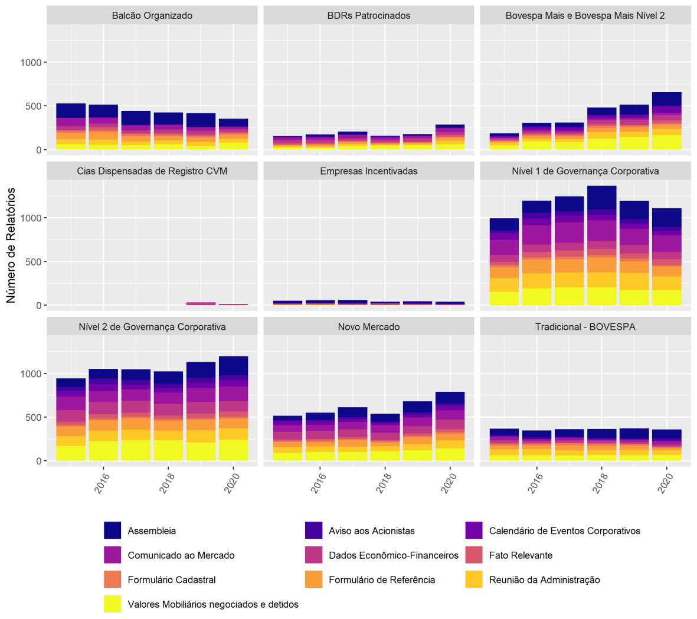

# Relatórios Obrigatórios no mercado de Capitais Brasileiro
<!-- Descrição curta sobre o que seu projeto faz. -->
> Programa desenvolvido em python para download de arquivos não estruturados listados na CVM

<!--
[![Build Status][travis-image]][travis-url]
[![Downloads Stats][npm-downloads]][npm-url]
-->
#
Com o aumento significativo de empresas listadas no mercado acionário e a modernização dos sistemas de informação, houve um aumento também no volume de informações disponíveis para análises de empresas. A maioria destes dados não estruturados em formato de textos e muitas vezes têm informações valiosas, estudos anteriores indicam que os relatórios financeiros além de refletir informações do passado, também contém informações sobre o desempenho futuro (Zhang et al 2018). A utilização de dados textuais para melhorar a modelagem da dinâmica do mercado financeiro tem sido a tradição da prática comercial.
Neste trabalho proponho uma estrutura de extração de dados não estruturados como relatórios financeiros, press releases, atas de assembleias entre outros apresentada pelas à Comissão de Valores Mobiliários (CVM) pelas empresas listadas na B3.
#
## Descrição e análise do problema
#
O regulador responsável pelo mercado de capitais brasileiro é a Comissão de Valores Mobiliários (CVM). As empresas nela cadastradas são obrigadas a divulgarem regularmente relatórios financeiros e não financeiros relativos ao seu exercício. Esses relatórios estão arquivados na CVM.
Pesquisas mostram que as empresas listadas do segmento Nível 1 e 2 de Governança Corporativa são as que mais possuem publicações de relatórios nos últimos 5 anos, devido ao ato nível e exigibilidade de divulgações (Checon et al. 2021).
#
||
|:--|
|Fonte: elaborado por Checon et al. 2021|
#
Algumas categorias de relatórios tem um volume alto de divulgação, como por exemplo os relatórios relacionados à assembleias (convocação de assembleias e ATAS), comunicados ao mercado e aviso aos acionistas devido a quantidade de eventos relacionados.
Os Dados Econômico-financeiros e  Formulário de referencia possuem um volume alto devido a reapresentação.
Para esta proposta foi focado inicialmente na extração de uma amostra de relatórios com mais publicações- empresas de do setor bancário pertencente ao Nível 1 de Governança, do setor bancário.
#

#

## Projetos similares

- [BrazilianMarketDataAPI](https://github.com/gustavomoers/BrazilianMarketDataAPI)
- [fundspy](https://github.com/joaopm33/fundspy)
 - [Pegando DRE do repositório da CVM](https://gist.github.com/Vido/cbc33862dd27a22790df633f1d113ae6)

#
## Bibliografia

Checon, Bianca Q., Santana, Verônica de F., Relatórios Obrigatórios e Padrôes de Divulgação no Mercado de Capitais. Artigo Cíclico n°8. FGV EASP Instituto de finanças

Zhang, X., Tan, Y. (2018). Deep Stock Ranker: A LSTM Neural Network Model for Stock Selection. In: Tan, Y., Shi, Y., Tang, Q. (eds) Data Mining and Big Data. DMBD 2018. Lecture Notes in Computer Science(), vol 10943. Springer, Cham. https://doi.org/10.1007/978-3-319-93803-5_58
